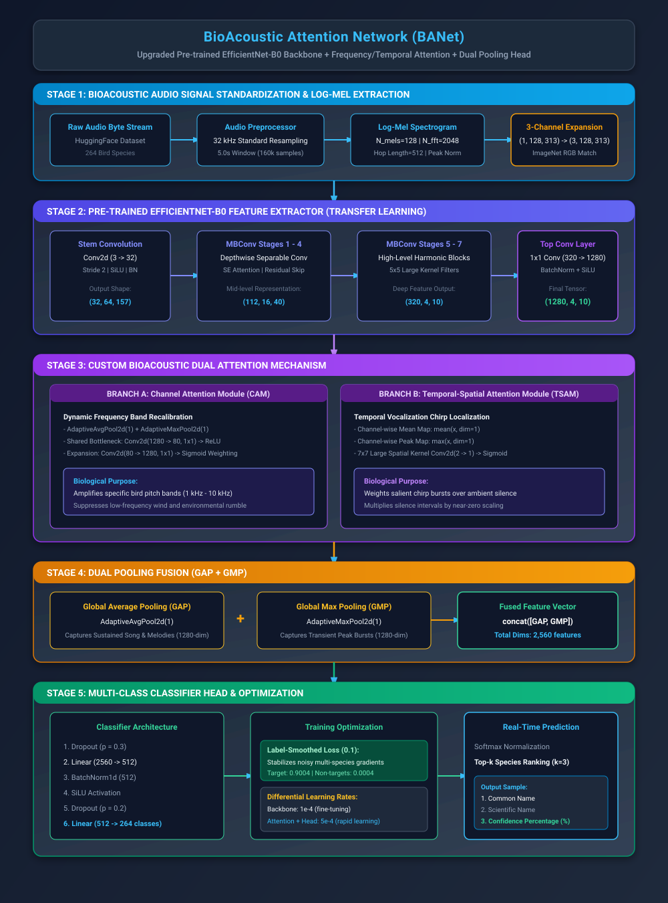
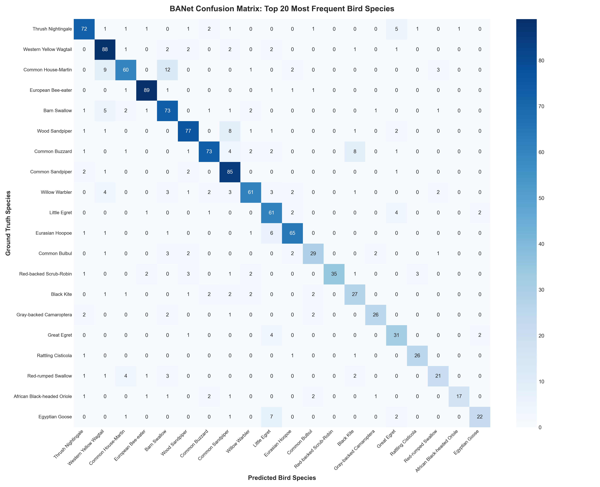

# BioAcoustic AI: Bird Species Recognition & Habitat Intelligence System

[](https://pytorch.org/)
[](https://developer.nvidia.com/cuda-toolkit)
[](https://react.dev/)
[](https://vitejs.dev/)
[](https://www.python.org/)
[](https://github.com/Adityakumar926/Bird-Species-Recognition-Using-Bioacoustic-Signals)
[](https://www.kaggle.com/competitions/birdclef-2023)

An end-to-end Bioacoustic Deep Learning system and interactive Web Application designed to identify **264 bird species** from sound recordings and dataset shards, extract time-frequency acoustic representations, and visualize geographic habitats.

Powered by **BANet (BioAcoustic Attention Network)** — a specialized architecture combining an **EfficientNet-B0** backbone with **Dual Time-Frequency Attention** and **Generalized Dual Pooling (GAP + GMP)**.

---

## Table of Contents

- [Key Features](#key-features)
- [System Architecture](#system-architecture)
- [Model Performance & Benchmarks](#model-performance--benchmarks)
- [Repository File & Directory Structure](#repository-file--directory-structure)
- [Dataset Acquisition & Preparation](#dataset-acquisition--preparation)
- [Installation & Environment Setup](#installation--environment-setup)
- [How to Run the Project](#how-to-run-the-project)
  - [1. Running the Interactive Web GUI (Recommended)](#1-running-the-interactive-web-gui-recommended)
  - [2. Running the Model Training & Evaluation Notebook](#2-running-the-model-training--evaluation-notebook)
  - [3. Running Inference Programmatically (Python Script)](#3-running-inference-programmatically-python-script)
- [Web Application UI & UX Highlights](#web-application-ui--ux-highlights)
- [Troubleshooting & FAQs](#troubleshooting--faqs)
- [Acknowledgements & Team](#acknowledgements--team)

---

## Key Features

1. **End-to-End Deep Learning Pipeline**:
   - Standardized audio preprocessing (resampling to 32 kHz, fixed 5.0s window, peak normalization).
   - High-resolution **128-band Log-Mel Spectrogram** generation ($0 - 16,000\text{ Hz}$).
   - Multi-class classification across **264 distinct avian species**.

2. **BioAcoustic Attention Network (BANet)**:
   - **Pre-trained EfficientNet-B0** feature extractor.
   - **Frequency Attention**: Dynamically weights discriminative spectral energy bands.
   - **Time Attention**: Focuses on salient bird calls while suppressing ambient forest/wind background noise.
   - **Dual Pooling**: Concatenation of Global Average Pooling (GAP) and Global Max Pooling (GMP).

3. **Universal Audio Support**:
   - Supports raw audio files: `.wav`, `.mp3`, `.ogg`, `.flac`, `.m4a`.
   - **Direct `.parquet` Shard Ingestion**: Upload BirdCLEF dataset shards directly without prior conversion; audio bytes are parsed automatically on the fly.

4. **Rich Bioacoustic Visualizations**:
   - **Mirrored Amplitude Waveform**: Real-time sound pressure envelope with playhead scrubbing and timeline indicators.
   - **2D Log-Mel Spectrogram**: Frequency distribution canvas rendered directly from audio tensors.

5. **Geographic Habitat & Coordinates Explorer**:
   - Resolves species to their median GPS latitude and longitude across East Africa.
   - Large interactive map powered by **OpenStreetMap** (100% free, zero API key required) with deep links to Google Maps.

---

## System Architecture

### BANet High-Level Model Architecture


### Pre-trained Backbone & Attention Mechanism


---

## Model Performance & Benchmarks

Validated across **3,389 out-of-fold test audio samples**:

| Metric | Score | Description |
| :--- | :--- | :--- |
| **Top-1 Accuracy** | **52.61%** | Exact 1st-choice correct species match |
| **Top-5 Accuracy** | **71.73%** | Correct species present in the top-5 candidates |
| **Weighted Precision** | **50.21%** | Sample-weighted precision across all 264 classes |
| **Weighted Recall** | **52.61%** | Sample-weighted recall across all 264 classes |
| **Weighted F1-Score**| **49.79%** | Harmonic mean of precision and recall |
| **Inference Latency**| **~270 ms** | Fast GPU forward-pass (NVIDIA RTX 4050 Laptop GPU) |

### Top Performing Species (F1-Score)
- **European Bee-eater**: 84.76% F1
- **Red-chested Cuckoo**: 84.44% F1
- **African Emerald Cuckoo**: 84.21% F1
- **Red-and-yellow Barbet**: 80.00% F1
- **Yellow-billed Barbet**: 76.92% F1

### Top-20 Confusion Matrix Heatmap


---

## Repository File & Directory Structure

```text
Bird-Species-Recognition-Using-Bioacoustic-Signals/
├── README.md                           # Master project documentation & instructions
├── banet_best_weights.pth              # Pre-trained PyTorch weights checkpoint (22.95 MB)
├── Bird Species Recognition.ipynb      # Complete 16-step training & validation notebook
├── BAnet_architecture.svg              # BANet architecture flowchart diagram
├── Pre-traned-BANet.svg                # Attention & pooling deep architecture diagram
├── confusion_matrix_top20.png          # High-resolution confusion matrix evaluation
├── .gitignore                          # Git exclusions (audio files, datasets, caches)
│
└── GUI/                                # Full-Stack Web Application
    ├── run_app.bat                     # One-click Windows launcher (starts backend + frontend)
    ├── README.md                       # GUI-specific architecture & developer notes
    │
    ├── backend/                        # Python Flask REST API & PyTorch Inference Service
    │   ├── server.py                   # Flask server with CORS (/api/health, /api/predict)
    │   ├── model.py                    # BANet PyTorch model definition & GPU predictor
    │   ├── audio_utils.py              # Audio decoders (.wav, .mp3, .parquet), Mel extraction
    │   ├── species_db.json             # 264-species metadata, scientific names & GPS coordinates
    │   ├── test_api.py                 # Automated REST endpoint integration test
    │   └── test_backend.py             # Inference validation script
    │
    └── frontend/                       # React 19 + Vite + Tailwind CSS Application
        ├── index.html                  # HTML entry point with Color Hunt theme config
        ├── package.json                # Frontend package dependencies (Lucide, Leaflet)
        ├── vite.config.js              # Vite bundler configuration
        └── src/
            ├── App.jsx                 # Master application layout & state coordinator
            ├── index.css               # Global theme styling, illustrative cards, dots
            └── components/
                ├── Header.jsx          # Header with live GPU status & accuracy metrics
                ├── FileUpload.jsx      # Drag-and-drop universal audio/parquet upload zone
                ├── Visualizer.jsx      # Mirrored amplitude envelope & Log-Mel spectrogram
                ├── SpeciesIntelligence.jsx # Top-5 ranked species candidate breakdown
                └── HabitatMap.jsx      # 480px interactive OpenStreetMap GPS explorer
```

---

## Dataset Acquisition & Preparation

The project is trained on the official **BirdCLEF 2023** bioacoustic benchmark dataset comprising audio recordings from Kenya and East Africa across 264 bird species.

### Option 1: HuggingFace Datasets (Recommended)
You can directly download or stream the dataset in Python:

```bash
pip install datasets pyarrow
```

```python
from datasets import load_dataset

# Load BirdCLEF 2023 train split
dataset = load_dataset("Syoy/birdclef_2023_train", split="train")
print(f"Total training samples: {len(dataset)}")
```

### Option 2: Official Kaggle Competition Download
If you have the Kaggle CLI configured:

```bash
kaggle competitions download -c birdclef-2023
unzip birdclef-2023.zip -d Dataset/
```

### Audio Specifications
- **Audio Sample Rate**: $32,000\text{ Hz}$ (Standardized)
- **Target Duration**: $5.0\text{ seconds}$ ($160,000$ audio samples)
- **Log-Mel Spectrogram Resolution**: $128\text{ Mel bins} \times 313\text{ time frames}$
- **FFT Parameters**: $N_{\text{fft}} = 1024$, $\text{Hop Length} = 512$, $f_{\text{min}} = 50\text{ Hz}$, $f_{\text{max}} = 14,000\text{ Hz}$

---

## Installation & Environment Setup

### 1. System Requirements
- **OS**: Windows 10/11, Ubuntu 20.04+, or macOS
- **Python**: Version 3.10 or higher (Anaconda / Miniconda recommended)
- **Node.js**: Version 18.0 or higher with `npm`
- **GPU (Optional, Recommended)**: NVIDIA GPU with CUDA 11.8 / 12.x for accelerated inference and training (CPU fallback is automatically supported).

### 2. Clone the Repository
```bash
git clone https://github.com/Adityakumar926/Bird-Species-Recognition-Using-Bioacoustic-Signals.git
cd Bird-Species-Recognition-Using-Bioacoustic-Signals
```

### 3. Set Up Python Environment
Create and activate an environment:

```bash
conda create -n bioacoustic python=3.10 -y
conda activate bioacoustic
```

Install core deep learning, signal processing, and server dependencies:

```bash
pip install torch torchvision torchaudio --index-url https://download.pytorch.org/whl/cu121
pip install librosa soundfile pyarrow pandas numpy flask flask-cors matplotlib seaborn tqdm
```

### 4. Set Up Frontend Environment
```bash
cd GUI/frontend
npm install
cd ../..
```

---

## How to Run the Project

### 1. Running the Interactive Web GUI (Recommended)

#### Quick Launch (Windows):
Simply double-click the included batch launcher:
```text
GUI\run_app.bat
```
This script automatically starts both the Python Flask backend and the React Vite development server, then opens `http://localhost:5173` in your default browser.

#### Manual Step-by-Step Launch:

**Step A — Start the Backend Server**:
```bash
cd GUI/backend
python server.py
```
*The server will initialize `banet_best_weights.pth` on CUDA GPU and listen at `http://127.0.0.1:5000`.*

**Step B — Start the Frontend Dev Server**:
```bash
cd GUI/frontend
npm run dev
```
*Open your browser and navigate to **`http://localhost:5173`**.*

---

### 2. Running the Model Training & Evaluation Notebook

The entire exploratory data analysis, data loaders, BANet model architecture, training loop, and evaluation benchmark suite are encapsulated in:
[`Bird Species Recognition.ipynb`](file:///C:/Users/Asus/Desktop/project/Bird%20Species%20Recognition.ipynb)

To launch and run the notebook:
```bash
jupyter notebook "Bird Species Recognition.ipynb"
```

#### Notebook Workflow:
1. **Steps 1–5**: Environment setup, metadata audit, audio duration and sampling rate inspection.
2. **Steps 6–9**: Mel-Spectrogram feature extraction, data augmentation, PyTorch Dataset & DataLoader creation.
3. **Steps 10–12**: BioAcoustic Attention Network (BANet) model definition with EfficientNet-B0 backbone.
4. **Steps 13–15**: Training execution loop with AdamW optimizer, CrossEntropy loss, and Cosine Annealing learning rate schedule.
5. **Step 16**: Comprehensive validation benchmarking (Top-1, Top-5, per-species F1 score, and 20-class confusion matrix).

---

### 3. Running Inference Programmatically (Python Script)

You can load the trained `banet_best_weights.pth` model directly in your Python scripts:

```python
import torch
import json
from GUI.backend.model import BANetPredictor

# 1. Initialize predictor (automatically selects CUDA if available)
predictor = BANetPredictor(weights_path="banet_best_weights.pth", num_classes=264)

# 2. Run inference on any audio file or .parquet shard
results = predictor.predict("sample_bird_call.wav", top_k=5)

# 3. Display predicted species
print("--- PREDICTION RESULTS ---")
for pred in results:
    print(f"Rank #{pred['rank']} | {pred['common_name']} ({pred['scientific_name']}): {pred['confidence']}%")
```

---

## Web Application UI & UX Highlights

The Web GUI is crafted with an **Illustrative Design** aesthetic and the vibrant, nature-inspired [Color Hunt Turquoise & Coral Palette](https://colorhunt.co/palette/8ad6d1359fa0fff0c5ff8c52):

- **Soothing Canvas (`#FCF9F0`)**: Eliminates harsh glare with a natural field-notebook warm base and subtle dotted texture.
- **Ocean Teal (`#359FA0`)**: Primary brand emblems, crisp headings, active border states, and high-frequency audio indicators.
- **Soft Mint Turquoise (`#8AD6D1`)**: Waveform upper mirror bars, secondary accent badges, and soft luminous glows.
- **Warm Butter Cream (`#FFF0C5`)**: Soothing telemetry containers, pill badges, and Leaflet popup card accents.
- **Sunset Coral (`#FF8C52`)**: Audio player scrub controls, waveform playhead, Rank #1 match hero badge, and confidence metrics.
- **Interactive Audio Waveform**: Mirrored amplitude sound pressure envelope with real-time audio scrub synchronization.
- **2D Log-Mel Spectrogram Canvas**: High-resolution spectral energy density rendered across 128 Mel frequency bins.
- **Large Geographic Habitat Map**: Full-width `480px` display at the bottom showing exact field observation coordinates with zero required API keys.

---

## Troubleshooting & FAQs

### Q: Does the Leaflet Map require an API key?
**No.** The map utilizes standard OpenStreetMap tiles (`https://tile.openstreetmap.org`), which are 100% free and open-source with zero API key requirements or watermarks.

### Q: Can I run this without an NVIDIA GPU?
**Yes.** PyTorch will automatically detect if CUDA is unavailable and seamlessly fall back to CPU execution.

### Q: How do I test with `.parquet` files?
You can directly drag-and-drop `.parquet` files from the BirdCLEF dataset into the GUI dropzone. The backend reads the embedded audio byte stream using `pyarrow` and processes it immediately.

---

## Acknowledgements & Team

- **Project Title**: Bird Species Recognition Using Bioacoustic Signals
- **Author / Lead Developer**: [Aditya Kumar](https://github.com/Adityakumar926)
- **Academic Context**: Project Group 18 &bull; Bioacoustic Machine Learning
- **Dataset Courtesy**: [Kaggle BirdCLEF 2023](https://www.kaggle.com/competitions/birdclef-2023) & [Xeno-Canto](https://xeno-canto.org/)
- **Core Frameworks**: PyTorch, Librosa, Torchaudio, React, Vite, Leaflet, Tailwind CSS, Flask.
